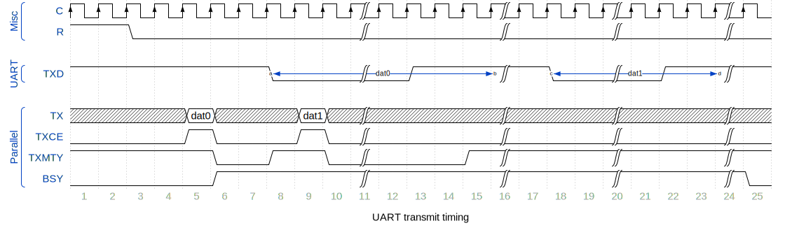

# Table of Contents

- [tinyUART](#tinyuart)
  * [Features](#features)
  * [Interface](#interface)
    + [Table of generics](#table-of-generics)
    + [Table of ports](#table-of-ports)
  * [Architecture](#architecture)
  * [Interface timing](#interface-timing)
    + [TX](#tx)
    + [RX](#rx)
  * [FPGA resource allocation](#fpga-resource-allocation)
  * [Used Tools](#used-tools)
  * [References](#references)

  
# tinyUART
UART core written in VHDL

## Features

* independent RX and TX path
* buffer register on RX and TX
* parameterizable data size
* one or two stop bits
* variable baud rate settings

## Interface

### Table of generics

| Name     | Type     | Default | Description                                          |
| -------- | -------- | ------- | ---------------------------------------------------- |
| DWIDTH   | integer  | 8       | data width                                           |
| CLK_HZ   | positive | 50e6    | core clock frequency in Hz                           |
| BAUD_BPS | positive | 115200  | UART transmission speed in baud per second           |
| STOPBIT  | integer  | 1       | number of stop bits, fracs not allowed               |
| RXSYNC   | integer  | 2       | data input to clock synchronization flip-flop stages |
| DEBOUNCE | integer  | 1       | majority voter for input debouncing; stages: 2n+1    |

### Table of ports

| Port     | Direction | Width  | Description                                        |
| -------- | --------- | ------ | -------------------------------------------------- |
| R        | input     | 1b     | asynchronous reset                                 |
| C        | input     | 1b     | clock, rising-edge only used                       |
| TXD      | output    | 1b     | serial UART output                                 |
| RXD      | input     | 1b     | serial UART input                                  |
| FRMERO   | output    | 1b     | framing error; start and stop bit not as expected  |
| RX       | output    | 4b..8b | received data value; highest bit is MSB            |
| RXCE     | output    | 1b     | new data value available, one clock cycle high     |
| TX       | input     | 4b..8b | transmit data value; highest bit is MSB            |
| TXMTY    | output    | 1b     | tx buffer register empty; ready to write new value |
| TXCE     | input     | 1b     | write data value to transmit; one clock cycle high |
| BSY      | output    | 1b     | RX and/or TX path is active                        |

## Architecture

 

 

## Interface timing

### TX

### RX

## FPGA resource allocation

| Entity    | Logic Elements | Registers | BRAM | Fmax   |
| --------- | -------------- | --------- | ---- | ------ |
| tiny_uart | 104            | 77        | 0    | 324MHz |

## Used Tools

| Task            | Tool                                                                                     |
| --------------- | ---------------------------------------------------------------------------------------- |
| VHDL entry      | [Notepad++](https://notepad-plus-plus.org)                                               |
| VHDL simulation | [ModelSim-Intel FPGA Edition](http://fpgasoftware.intel.com/?product=modelsim_ae#tabs-2) |
| FPGA synthesis  | [Quartus Prime Lite Edition (Free)](http://fpgasoftware.intel.com/?edition=lite)         |
| block diagram   | MS Visio 2013                                                                            |
| timing diagram  | [WaveDrom](https://github.com/wavedrom/wavedrom.github.io/releases)                      |

## References

* [Wikipedia: UART](https://en.wikipedia.org/wiki/Universal_asynchronous_receiver-transmitter)
* [Wikipedia: Parity](https://en.wikipedia.org/wiki/Parity_bit)
