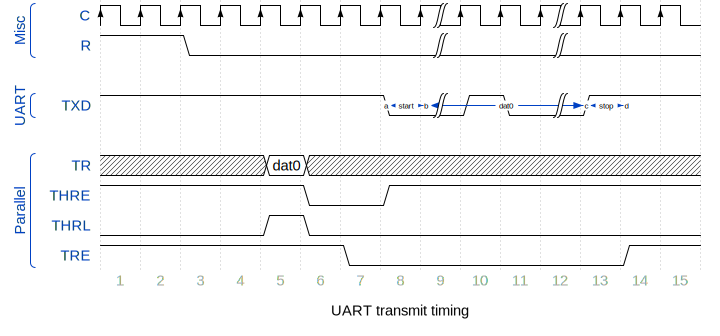

- [tinyUART](#tinyuart)
  * [Releases](#releases)
  * [Features](#features)
  * [Interface](#interface)
    + [Generics](#generics)
    + [Ports](#ports)
  * [Architecture](#architecture)
  * [Timing](#timing)
    + [TX](#tx)
    + [RX](#rx)
  * [Resource allocation](#resource-allocation)
  * [References](#references)

# tinyUART
Lightweight [UART](https://en.wikipedia.org/wiki/Universal_asynchronous_receiver-transmitter) core written in VHDL.

## Releases

| Version                                                  | Date       | Source                                                                                                 | Change log                                                                               |
| -------------------------------------------------------- | ---------- | ------------------------------------------------------------------------------------------------------ | ---------------------------------------------------------------------------------------- |
| latest                                                   |            | <a id="raw-url" href="https://github.com/akaeba/tinyUART/archive/refs/heads/master.zip">latest.zip</a> |                                                                                          |
| [v0.1.0](https://github.com/akaeba/tinyUART/tree/v0.1.0) | 2018-09-06 | <a id="raw-url" href="https://github.com/akaeba/tinyUART/archive/refs/tags/v0.1.0.zip">v0.1.0.zip</a>  | initial draft                                                                            |

## Features

* independent RX and TX path
* buffer register on RX and TX
* parameterizable data size
* one or two stop bits
* settable baud rate

## Interface

### Generics

| Name   | Default    | Values   | Description                       |
| ------ | ---------- | -------- | --------------------------------- |
| WLS    | 8          | 5..8     | word length select; data bits     |
| CLK    | 50_000_000 | positive | master clock frequency in Hz      |
| BPS    | 115200     | positive | baud rate per second              |
| SBS    | 1          | 1..2     | Stop bit select                   |
| PI     | true       | boolean  | Parity inhibit                    |
| EPE    | true       | boolean  | Even parity enable, otherwise odd |
| DEBU   | 3          | 0..11    | debouncer stages                  |
| TXIMPL | true       | boolean  | TX path implemented               |
| RXIMPL | true       | boolean  | RX path implemented               |

_Settable at compile time._

### Ports

| Port | Dir | Width  | Description                             |
| ---- | --- | ------ | --------------------------------------- |
| R    | in  | 1b     | asynchronous reset                      |
| C    | in  | 1b     | clock, rising-edge only                 |
| TXD  | out | 1b     | serial UART output                      |
| RXD  | in  | 1b     | serial UART input                       |
| RR   | out | 5b..8b | Receiver Holding Register Data Output   |
| PE   | out | 1b     | Parity error                            |
| FE   | out | 1b     | Framing error                           |
| DR   | out | 1b     | Data Received, one clock cycle high     |
| TR   | in  | 5b..8b | Transmitter Holding Register Data Input |
| THRE | out | 1b     | Transmitter Holding Register Empty      |
| THRL | in  | 1b     | Transmitter Holding Register Load       |
| TRE  | out | 1b     | Transmitter Register Empty              |

## Architecture

The block diagram visualizes the simplified _tinyUART_ architecture. Blocks with solid lines are own sub entities. All blocks with dashed lines are implemented
in the top level.

 

 

## Timing

### TX

### RX

## Resource allocation

| Technology | HDL generics                        | Logic | Registers | BRAM | Fmax |
| ---------- | ----------------------------------- | ----- | --------- | ---- | --------------- |
| Cyclone 10 | [defaults](#Generics)               | 89LEs | 79FF      | 0    | 89.61MHz        |
| Cyclone 10 | [defaults](#Generics), TXIMPL=false | 43LEs | 41FF      | 0    | 89.61MHz        |
| Cyclone 10 | [defaults](#Generics), RXIMPL=false | 50LEs | 38FF      | 0    | 89.67MHz        |

## References

* [Wikipedia: UART](https://en.wikipedia.org/wiki/Universal_asynchronous_receiver-transmitter)
* [Wikipedia: Parity](https://en.wikipedia.org/wiki/Parity_bit)
* [Western Digital: TR1602](https://datasheetspdf.com/pdf-file/1412122/WesternDigital/TR1602/1)
